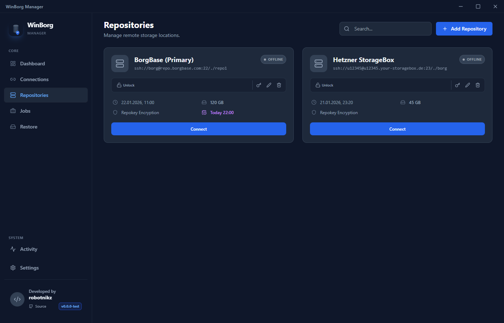
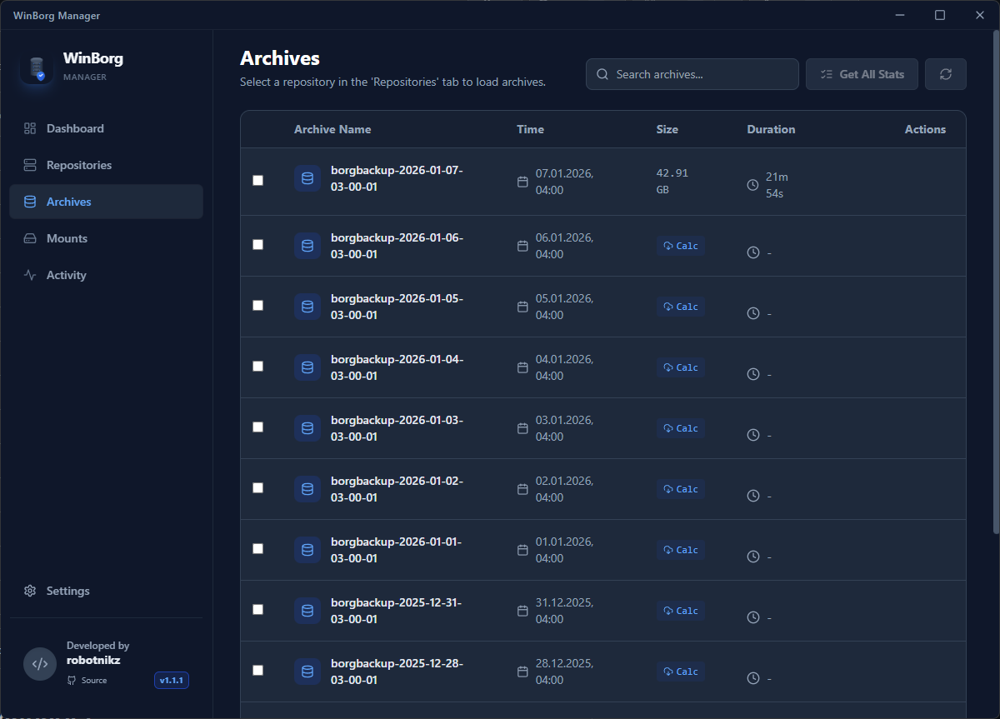
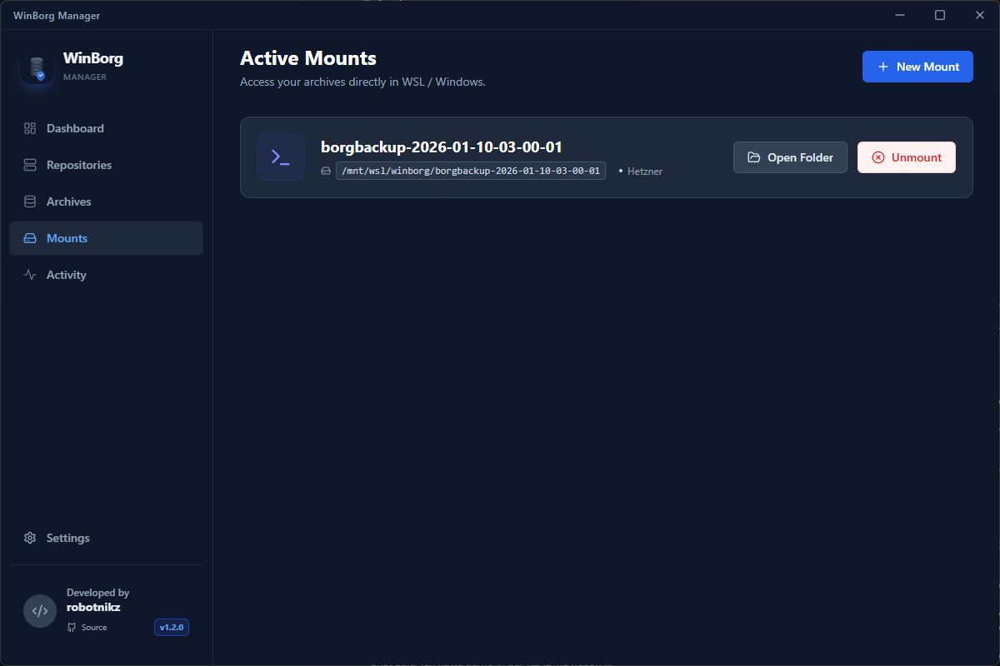

<div align="center">

  

  # WinBorg Manager
  
  **The native Windows GUI for BorgBackup.**
  
  Stop wrestling with CLI commands. Start backing up reliably.
  Enterprise-grade security meets Windows 11 elegance.

  <!-- Badges -->
  [](https://github.com/robotnikz/WinBorg/releases)
  [](https://github.com/robotnikz/WinBorg/actions/workflows/cicd.yml)
  [](https://github.com/robotnikz/WinBorg/releases)
  [](LICENSE)
  [](https://reactjs.org/)

  **Quick links:**
  [Download (Installer)](https://github.com/robotnikz/WinBorg/releases/latest) •
  [All Releases](https://github.com/robotnikz/WinBorg/releases) •
  [Docs](docs/README.md) •
  [Testing](docs/TESTING.md) •
  [Security](SECURITY.md)
  
</div>

---

## ⚡ What is WinBorg?

WinBorg Manager is a modern GUI that brings the power of **[BorgBackup](https://borgbackup.readthedocs.io/en/stable/)** to Windows without the complexity. 

By leveraging **WSL2 (Windows Subsystem for Linux)**, it runs the official, unmodified Linux binaries of BorgBackup for maximum stability and performance, while presenting you with a completely native, polished Windows 11-style interface.

Whether you're backing up your local Documents to a NAS, or your entire dev environment to BorgBase or Hetzner StorageBox, WinBorg makes it simple.

## 🚀 Quickstart (TL;DR)

1. Download the latest Windows installer from the [Releases page](https://github.com/robotnikz/WinBorg/releases/latest).
2. Launch WinBorg and follow the onboarding for **WSL2 + Ubuntu + BorgBackup**.
3. Add a repository (e.g. Hetzner Storage Box / BorgBase), create a job, and run your first backup.

If you run into issues, jump to [docs/TESTING.md](docs/TESTING.md), [OPERATIONS.md](OPERATIONS.md), and [SECURITY.md](SECURITY.md).

## 📌 Contents

- [Requirements](#-requirements)
- [Key Features](#-key-features)
- [Gallery](#-gallery)
- [Installation & Getting Started](#-installation--getting-started)
- [Troubleshooting (FAQ)](#-troubleshooting-faq)
- [Project Structure](#-project-structure)
- [Testing](#-testing)
- [Contributing](#-contributing)

## ✅ Requirements

- Windows 10/11 with **WSL2** support (virtualization enabled in BIOS/UEFI or VM settings)
- An Ubuntu WSL distro (WinBorg can install this during onboarding)
- BorgBackup inside Ubuntu (WinBorg can install this during onboarding)
- For remote repos: SSH access to your backup target (StorageBox/BorgBase/VPS/NAS)
- For **Mounts**: WinBorg automatically checks/repairs common FUSE prerequisites inside WSL during the mount flow (bindings, permissions). If `/dev/fuse` is missing, this typically requires WSL2 + `wsl --update` + reboot/shutdown (see [OPERATIONS.md](OPERATIONS.md)).

## 🧩 Troubleshooting (FAQ)

- **“WSL Setup Required” / WSL install fails:** ensure virtualization (VT-x/AMD-V) is enabled; reboot after `wsl --install --no-distribution`.
- **Ubuntu install prompts for username/password:** that’s expected; finish the Ubuntu first-run setup, then return to WinBorg.
- **“BorgBackup Not Found”:** open Ubuntu and run `sudo apt update` + `sudo apt install -y borgbackup` (or use WinBorg’s auto-install).
- **SSH “Permission denied (publickey)” / can’t connect:** use WinBorg’s **Install SSH Key** flow; double-check host, user, and port (Hetzner Storage Box often uses port 23).
- **Mounts don’t show up / fail:** WinBorg auto-fixes most FUSE issues during mount; if it still fails, check whether `/dev/fuse` exists in your WSL distro and follow [OPERATIONS.md](OPERATIONS.md).

## ✨ Key Features

### 🛡️ Smart & Secure Setup
*   **Automatic SSH Key Management:** WinBorg handles the complex SSH setup for you. 
    *   **Generate:** Integrated key generator creates secure `Ed25519` keys.
    *   **Deploy:** One-click deployment of your public key to any remote server (Linux VPS, Hetzner StorageBox, etc.).
*   **Remote Server Provisioning:** No need to SSH into your server manually. WinBorg can **automatically install BorgBackup** on your remote Debian/Ubuntu server directly from the GUI.
*   **Strict Security:** Enforces safe practices like mandatory passphrases for encrypted repos and validates host keys.

### 📂 Full Management Suite
*   **Easy Repository Wizard:** 
    *   **Quick Start Templates:** One-click presets for popular providers like **Hetzner Storage Box**, **BorgBase**, **Rsync.net**, and local NAS.
    *   **Smart Auto-Detection:** Automatically detects standard paths and ports (e.g., Port 23 for Hetzner) to prevent configuration errors.
    *   **Connect:** Smart detection of existing repositories.
    *   **Initialize:** Interactive guide to set up new encrypted repositories with secure presets.
*   **Archives:** Browse all your snapshots with detailed metadata (size, time, duration).
*   **File Browser:** Explore the contents of *any* old archive and download/restore specific files effortlessly.
*   **Mounting:** Mount archives as a FUSE filesystem (requires configured FUSE inside WSL).
*   **Diff Viewer:** See exactly what changed between two backups (Added/Modified/Deleted files).

### 🤖 Automation & Monitoring
*   **Auto-Updater:** Built-in update system that checks for new releases periodically.
*   **Background Jobs:** Schedule backups to run automatically (Hourly/Daily/Weekly).
*   **Notifications:** Get native Windows toasts, **Discord Webhook** alerts, or **Email Notifications** (SMTP) when backups finish or fail.
*   **Pruning:** Automated retention policies (e.g., "Keep 7 daily, 4 weekly").
*   **Settings Export/Import:** Backup and restore your WinBorg configuration after reinstalling.

---

## 🖼️ Gallery

<div align="center">
  
  &nbsp;
  
  <br/>
  <br/>
  
  &nbsp;
  
</div>

---

## 🚀 Installation & Getting Started

WinBorg is designed to be usable by everyone, not just sysadmins. It automatically guides you through installing the required Windows + Linux components (WSL2 + Ubuntu + BorgBackup).
### 1. Simple Installation
1.  **Download:** Get the latest installer (`.exe`) from the [Releases Page](https://github.com/robotnikz/WinBorg/releases).
2.  **Run Installer:** Double-click the downloaded file. Windows might ask for permission; click "Yes".
3.  **Launch:** Open "WinBorg Manager" from your desktop or Start Menu.

### 2. Automatic Onboarding
When you open WinBorg for the first time, it will check your system and guide you through these steps:

1.  **Enable WSL (Admin step)**
  - If WSL2 is missing/disabled, WinBorg shows **"WSL Setup Required"**.
  - Click **"Install WSL (Admin)"** and accept the Windows administrator prompt.
  - When it finishes, WinBorg will tell you a **restart is required**.

2.  **Restart Windows**
  - Click **"Restart Computer Now"** (or restart manually).
  - After reboot, launch WinBorg again.

3.  **Install Ubuntu (WSL) (User step)**
  - If WSL is enabled but no supported distro exists yet, WinBorg offers **"Install Ubuntu (WSL)"**.
  - This step is intentionally **not** run as admin: WSL distros are installed *per Windows user account*.
  - A PowerShell window will open. If Ubuntu asks for a **new username + password**, complete it.
  - Once you see the Ubuntu shell prompt, close the window and return to WinBorg.

4.  **Install BorgBackup inside Ubuntu**
  - If BorgBackup is missing, WinBorg shows **"BorgBackup Not Found"**.
  - Click **"Install Borg (Auto)"**. WinBorg will run `apt-get update` + `apt-get install borgbackup` inside Ubuntu.

If anything goes wrong, use **"Retry Check"** / **"Check Again"** in the dialog. WinBorg also provides a **"Show details"** toggle for advanced troubleshooting output.

> Tip: In some environments (especially VMs), WSL2 requires virtualization support (VT-x/AMD-V / nested virtualization). If WinBorg reports virtualization issues, enable virtualization in BIOS/UEFI or your VM settings.

### 3. Creating your First Backup
1.  Click **"Add Repository"**.
2.  **Remote Backup (Recommended):** Use a service like **Hetzner Storage Box** or **BorgBase**.
    *   Enter the Server URL (e.g., `ssh://user@your-server.com`).
    *   **SSH Key Missing?** WinBorg will detect this. Click **"Install SSH Key"**, enter your server password *once*, and WinBorg will secure the connection forever.
    *   **Borg Missing on Server?** If the server doesn't have backup software, WinBorg offers to **"Install Borg on Server"** automatically.
3.  **Initialize:** Give your repo a name and a secure password.
4.  **Done!** You can now create your first backup.

### 🔧 Manual Details (For Advanced Users)
If you prefer tight control over your system environment, you can install the dependencies manually before running WinBorg. This allows you to skip parts of the auto-onboarding flow.

**1. Enable WSL (no distro yet) [Admin]**
This enables the required Windows features. Run in PowerShell **as Administrator**:
```powershell
wsl --install --no-distribution
# Restart Windows after this finishes.
```

**2. Install Ubuntu for your Windows user [Non-Admin]**
After reboot, run in a normal (non-admin) PowerShell:
```powershell
wsl --install -d Ubuntu
```
If prompted, create a new Ubuntu username/password.

**3. Install BorgBackup inside Ubuntu**
Open the Ubuntu terminal (Start Menu → "Ubuntu") and run:
```bash
sudo apt update
sudo apt install -y borgbackup
```

**4. Verify Installation**
WinBorg automatically looks for the binary. Verify it exists:
```bash
which borg
# Should return: /usr/bin/borg
```

### 5. Your First Backup (Manual Path)
1.  Go to the **Repositories** tab and click `+ Add Repository`.
2.  Enter your SSH URL (e.g., `ssh://u123@your-provider.com/./backups`) or a local path.
3.  Once connected, go to **Dashboard**, create a Job ("Backup Documents"), and hit Run ▶️.

---

## 🛠 Project Structure

WinBorg is built with:
*   **Frontend:** React 18 + TypeScript + Vite + Tailwind CSS.
*   **Desktop App:** Electron (main process in `electron-main.js`).
*   **Main-process modules:** `main/` contains dependency-injected helpers used by the Electron main process (keeps logic unit-testable).
*   **WSL/Borg Integration:** Borg runs inside WSL2 using the official Linux binaries.
*   **Testing:** Vitest (unit) + Playwright (Electron E2E with deterministic IPC mocks).
*   **CI:** GitHub Actions runs typecheck, unit tests with coverage, build, and E2E.

## ✅ Testing

```bash
# Unit tests
npm test

# Unit tests with coverage (threshold-gated)
npm run test:coverage

# E2E (Playwright launches Electron)
# Note: the E2E scripts run a build first via pretest hooks.
npm run test:e2e

# Fast smoke subset
npm run test:e2e:smoke
```

More details: see [docs/TESTING.md](docs/TESTING.md).

## 🤝 Contributing

We welcome contributions!

1.  Fork the repository.
2.  Create a feature branch (`git checkout -b feature/NewThing`).
3.  Commit your changes (we use **Semantic Release**, so please use conventional commits like `feat:`, `fix:`, `docs:`).
4.  Push and open a Pull Request targeting `main`.

### Running Locally
```bash
# Install deps
npm install

# Run dev mode (Vite + Electron)
# - `electron` uses the default Vite port (5174)
# - `electron:dev` auto-picks a free port (handy if 5174 is already in use)
npm run electron
# or
npm run electron:dev

# Run tests
npm run test
```

---
