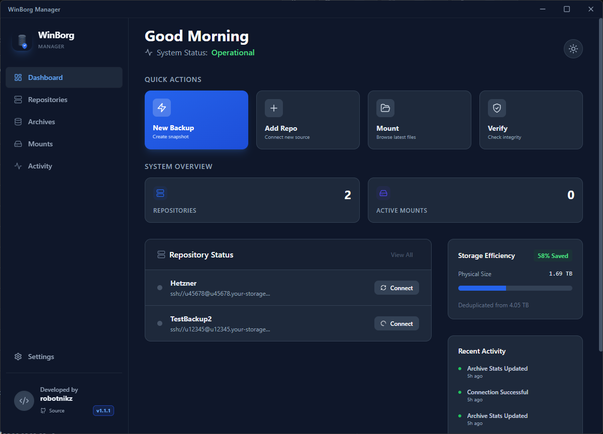

<div align="center">

  

  # WinBorg Manager
  **The Ultimate Windows GUI for BorgBackup**

  [](https://github.com/robotnikz/WinBorg/releases)
  [](https://github.com/robotnikz/WinBorg/actions/workflows/release.yml)
  [](https://microsoft.com)
  [](LICENSE)
  [](https://reactjs.org/)

  <p align="center">
    <b>Enterprise-grade backups with the comfort of a modern Windows UI.</b><br />
    Leverages the power of WSL to run Borg natively, bridging the gap between Linux performance and Windows usability.
  </p>

  [Download Latest Release](https://github.com/robotnikz/WinBorg/releases/latest) • [Report Bug](https://github.com/robotnikz/WinBorg/issues)

</div>

---



## ⚡ Why WinBorg?

BorgBackup is amazing, but using it on Windows via command line can be a hassle. **WinBorg Manager** changes that. It acts as a native bridge to **WSL (Windows Subsystem for Linux)**, giving you the raw speed and reliability of Linux-native Borg, wrapped in a beautiful **Windows 11 Mica-style** interface.

### ✨ Key Features

<table>
  <tr>
    <td width="50%">
      <h3>📂 Seamless Mounting</h3>
      <p>Mount your backup archives as virtual drives (e.g., <code>Z:</code>) and browse your history directly in <b>Windows Explorer</b>. Drag, drop, and restore single files effortlessly.</p>
    </td>
    <td width="50%">
      <h3>📅 Set & Forget Scheduling</h3>
      <p>Configure persistent backup jobs with custom schedules (Hourly/Daily). The app minimizes to the <b>System Tray</b> and keeps your data safe in the background.</p>
    </td>
  </tr>
  <tr>
    <td width="50%">
      <h3>🔍 Visual Diff Viewer</h3>
      <p>Wondering what changed between yesterday and today? The built-in <b>Diff Viewer</b> shows you exactly which files were added, modified, or removed.</p>
    </td>
    <td width="50%">
      <h3>🔔 Smart Notifications</h3>
      <p>Get native Windows notifications, or configure <b>Discord Webhooks</b> and <b>SMTP Email</b> alerts to know immediately when a backup succeeds or fails.</p>
    </td>
  </tr>
  <tr>
    <td width="50%">
      <h3>🛡️ Security & Pruning</h3>
      <p>Full support for <b>Repokey & Keyfile</b> encryption. Automated retention policies (Keep 7 dailies, 4 weeklies, etc.) keep your storage usage efficient.</p>
    </td>
    <td width="50%">
      <h3>📊 Storage Efficiency</h3>
      <p>See exactly how much space Borg's deduplication is saving you with a live dashboard tracking compressed vs. original size.</p>
    </td>
  </tr>
</table>

## 🛠️ Tech Stack

*   **Frontend:** React 18, TypeScript, Tailwind CSS (Dark/Light Mode)
*   **Backend:** Electron, Node.js
*   **Core:** BorgBackup running inside WSL (Ubuntu/Debian)

---

## 🚀 Getting Started

### 1. Prerequisites (One-time Setup)

WinBorg relies on WSL to do the heavy lifting.
1.  **Enable WSL:** Open PowerShell as Admin and run `wsl --install`. Restart your PC.
2.  **Install Borg in WSL:** Open your Ubuntu terminal and run:
    ```bash
    sudo apt update && sudo apt install borgbackup fuse3 libfuse2 python3-llfuse python3-pyfuse3 -y
    ```
3.  **Enable FUSE (For Mounting):**
    ```bash
    echo "user_allow_other" | sudo tee -a /etc/fuse.conf
    sudo chmod 666 /dev/fuse
    ```
    *(Note: WinBorg has a built-in helper to run this command for you if you forget!)*

### 2. Installation
Download the `.exe` installer from the [Releases Page](https://github.com/robotnikz/WinBorg/releases).
> **Note:** As this is an open-source project, the installer is not code-signed. Windows SmartScreen may warn you. Click "More Info" -> "Run Anyway".

### 3. Your First Backup
1.  **Add Repo:** Click `+` and paste your SSH URL (e.g., Hetzner StorageBox, BorgBase, or local NAS).
2.  **Create Job:** Go to the repo, click the Briefcase icon 💼, and set up a "Daily" job for your `Documents` folder.
3.  **Run:** Click Play ▶️ and watch the logs stream in real-time!


---

## ❤️ Contributing

Found a bug? Want to add a feature?

1.  Clone the repo: `git clone https://github.com/robotnikz/WinBorg.git`
2.  Install deps: `npm install`
3.  Run dev mode: `npm run electron`

**License:** MIT
